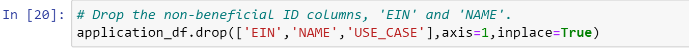
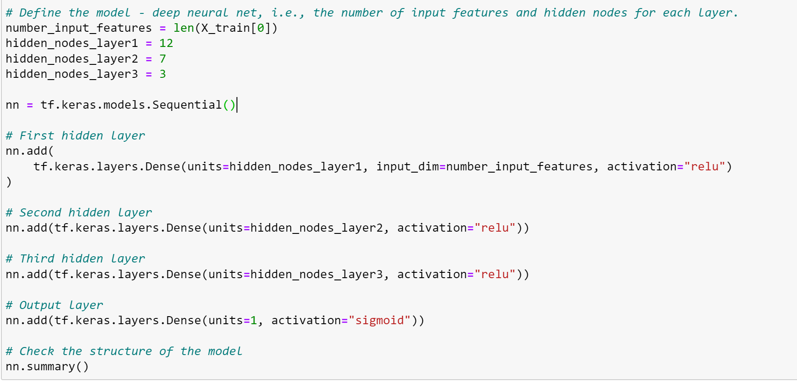
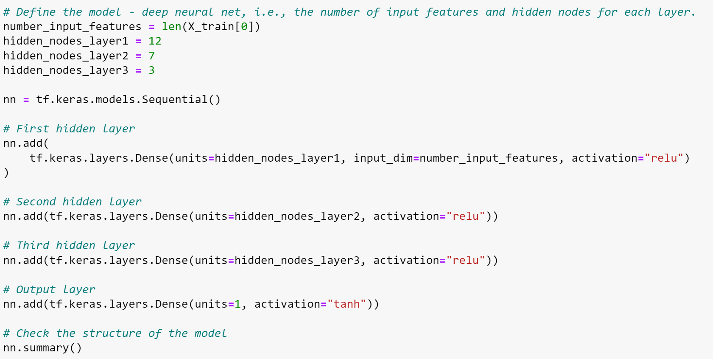

# Neural Network Charity Analysis

##Overview

With the knowledge of machine learning and neural networks, we use the features in the provided dataset to create a binary classifier that is capable of predicting whether applicants will be successful if funded by Alphabet Soup. For this analysis, we have a dataset containing more than 34,000 organizations that have received funding from Alphabet Soup. 

##Results

### Data Preprocessing

#### Variables used as targets for the model
The variable "IS_SUCCESSFUL" was used as the target for the model.

#### Variables considered to be the features for the model
The following variables were considered to be the features for the model:
APPLICATION_TYPE, AFFILIATION, CLASSIFICATION, USE_CASE, ORGANIZATION, STATUS, INCOME_AMT, SPECIAL_CONSIDERATIONS AND ASK_AMT.

#### Variables that are neither targets nor features (to be removed from target data)
EIN and NAME were removed from the data as these were neither targets or features.

### Compiling, Training, and Evaluating the Model

#### Number of neurons, layers, and activation functions selected and justification
15 Neurons and 2 Hidden layers were used. We selected relu activation function to identify nonlinear characteristics from the input values for the 2 Hidden layers; and sigmoid function for the outer layer to help predict the probability of the output.

#### Ability to achieve the target model performance
To train the model we used 100 epochs and it showed a loss of 0.5428 and an accuracy of 0.7364. 

When evaluating the model using the test data we saw a loss of 0.5535 and an accuracy of 0.7261.

#### Steps taken to increase model performance

The model was optimized, and the predictive accuracy was attempted to be increased to a target of 75%. 

##### First Attempt
Removed one noisy variable USE_CASE. This led to loss of 0.5568 and accuracy of 0.7261 using the test data.

##### Second Attempt
Added additional neurons and additional hidden layers as illustrated below:

This led to loss of 0.5621 and accuracy of 0.7247 using the test data.

##### Third Attempt
Changed the activation function of the output layer from sigmoid to tanh; and increasing the number of epochs from 100 to 300.

This led to loss of 8.2242 and accuracy of 0.4668 using the test data.

## Summary

The overall results after three attempts showed a loss of 8.2242 and an accuracy of 0.4668 (46.68%). This was well below the target accuracy of 75%. Sigmoid activation function in the outer layer appeared to perform significantly better relative to tanh. It would be a good exercise to use Random Forest on this dataset to see if we can get a better result. As the dataset is tabular, random forest is likely a good place to start.